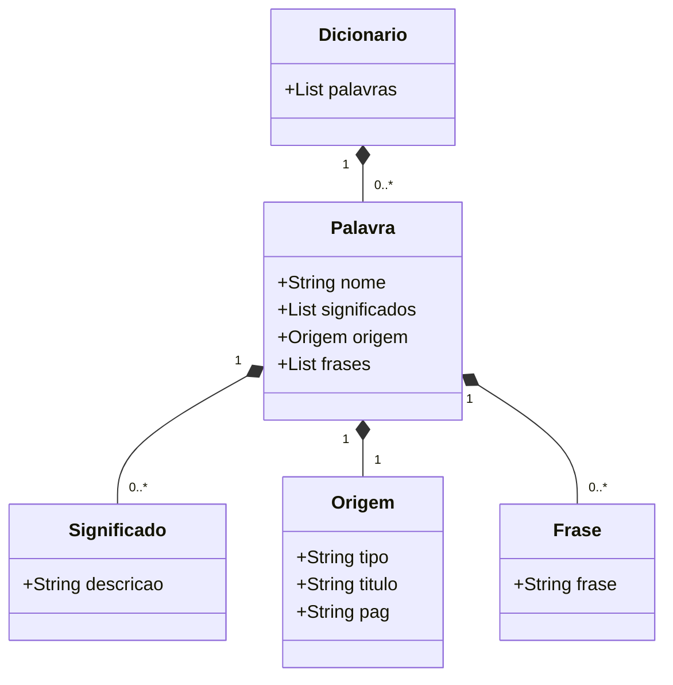

# dionario com jdbc

## Banco oracle e flyway

Para conectar o Flyway ao banco Oracle, enfrentei sérios problemas, desde questões de conexão até permissões de usuários. Isso exigiu muita pesquisa, mas foi extremamente benéfico para o meu aprendizado.

Fiz um resumo explicando o motivo de ter tomado determinadas decisões para conseguir dar andamento ao projeto.

[Guia Oracle XEPDB1 Flyway](Guia_Oracle_XEPDB1_Flyway.pdf)
