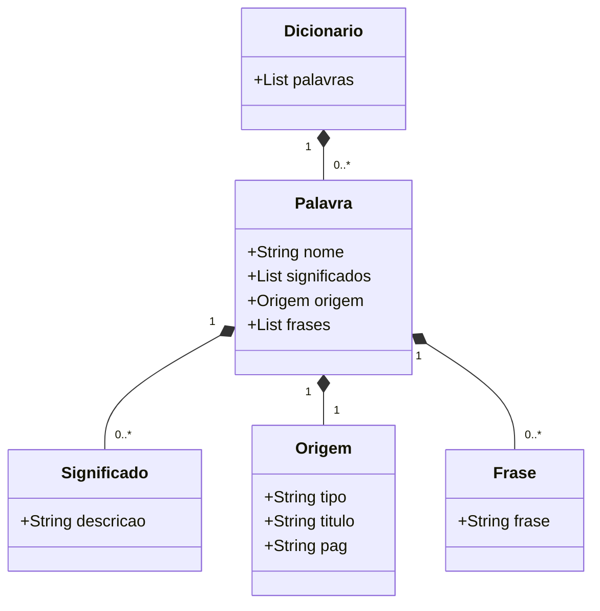

# dionario com jdbc

```mermaid
classDiagram
    class Dicionario {
        +List<Palavra> palavras
    }

    class Palavra {
        +String nome
        +List<Significado> significados
        +Origem origem
        +List<Frase> frases
    }

    class Significado {
        +String descricao
    }

    class Origem {
        +String tipo
        +String titulo
        +String pag
    }

    class Frase {
        +String frase
    }

    Dicionario "1" *-- "0..*" Palavra
    Palavra "1" *-- "0..*" Significado
    Palavra "1" *-- "1" Origem
    Palavra "1" *-- "0..*" Frase
```

t