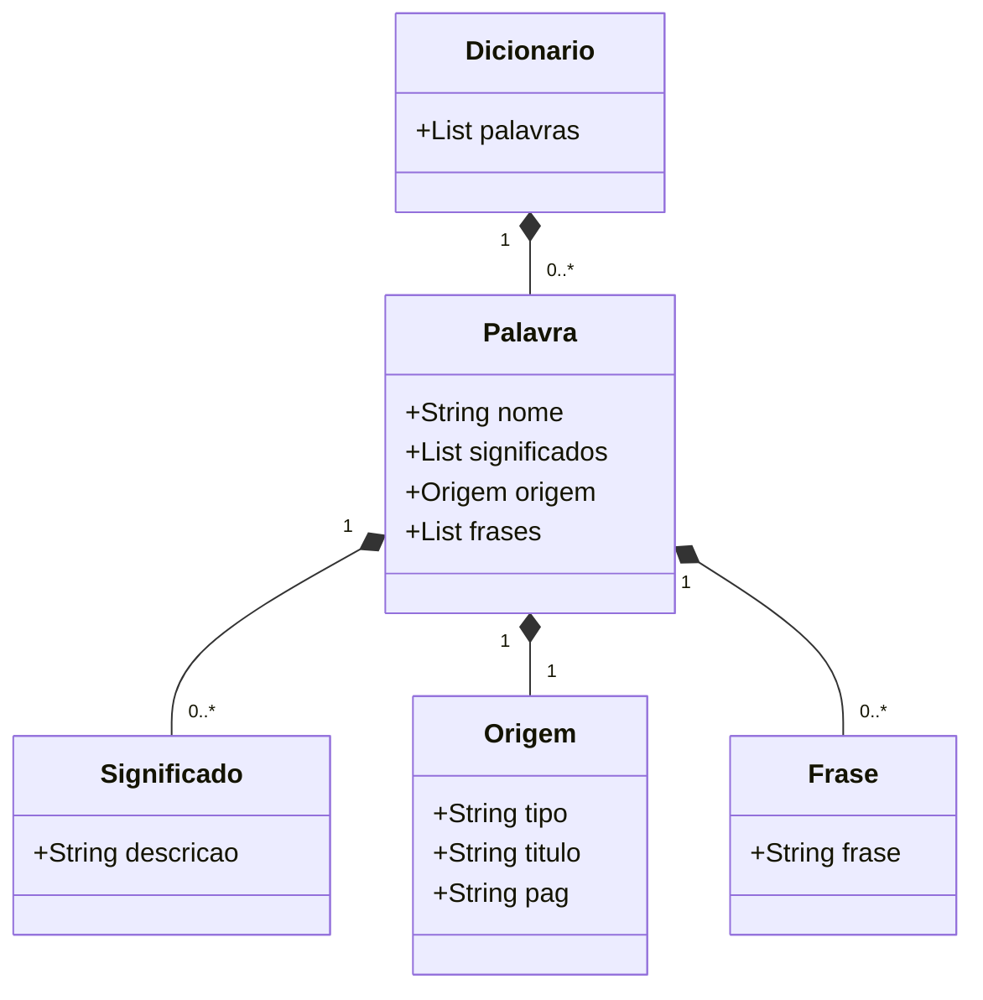

# 📖 Projeto Dicionário

Este projeto tem como objetivo a criação e manipulação de dicionários personalizados, permitindo cadastrar palavras, frases, origens e consultar as informações de forma organizada.

---

## 🌱 Origem da Ideia

Este projeto surgiu de uma necessidade pessoal: **ampliar meu vocabulário**.  
Durante pesquisas no YouTube, encontrei o vídeo [COMO AUMENTAR RÁPIDO SEU VOCABULÁRIO com 1 exercício simples (e usar no dia a dia)](https://www.youtube.com/watch?v=VtMGkOjebxw), que apresentou uma técnica prática:

- Ler um livro  
- Anotar palavras desconhecidas  
- Pesquisar seus significados  
- Criar frases utilizando essas palavras  

No entanto, fazer isso no papel se mostrou complicado:
- As palavras ficavam soltas e espalhadas em anotações diferentes  
- Muitas vezes eu esquecia onde tinha anotado  
- As frases não tinham ligação com a lista de palavras  

Diante dessa dificuldade, surgiu a ideia de criar este **sistema de dicionário digital**, que organiza todo esse processo de forma prática e acessível.

---

## 🚀 Funcionalidades Iniciais

- **Adicionar um dicionário**
- **Ver dicionários**
- **Adicionar palavra a um dicionário**
- **Adicionar frase à palavra**
- **Adicionar origem da palavra**
- **Ver dicionário completo**

---

## 📌 Futuras Melhorias
- Quebrar o menu por funcionalidades:
  - Menu de dicionários
  - Menu de palavras
  - Menu de significados
  - Menu de frases
  - Menu de origens
- Atualizar / excluir:
  - Dicionários
  - Palavras
  - Significados
  - Frases
  - Origens

---

## 🧩 Diagrama de Classes



## Banco oracle e flyway

Para conectar o Flyway ao banco Oracle, enfrentei sérios problemas, desde questões de conexão até permissões de usuários. Isso exigiu muita pesquisa, mas foi extremamente benéfico para o meu aprendizado.

Fiz um resumo explicando o motivo de ter tomado determinadas decisões para conseguir dar andamento ao projeto.


[Guia Oracle XEPDB1 Flyway](Guia_Oracle_XEPDB1_Flyway.pdf)

## 👤 Criando o usuário `DICIONARIO`

Para usar o **Flyway** com **Oracle**, é necessário criar um usuário a partir do **SYS** (perfil `SYSDBA`) conectado ao **service XEPDB1**, e conceder suas devidas permissões.

---

### 🔑 Diferença entre **SID** e **Service Name**

- **SID (XE)**  
  - 🗂️ Representa a **instância raiz** do Oracle.  
  - 📦 Corresponde ao **Container Database (CDB)**.  
  - 👨‍💻 Apenas usuários administrativos existem nesse nível (como `SYS` e `SYSTEM`).  
  - 🚫 Usuários comuns não podem ser criados aqui.  

- **Service Name (XEPDB1)**  
  - 📌 É um **Pluggable Database (PDB)**.  
  - 👥 É onde os **usuários e aplicações** realmente são criados e utilizados.  
  - ✅ Usuários criados (como `DICIONARIO`) só existem dentro desse **PDB**.  
  - ⚠️ Se você tentar logar no `XE` com o usuário `DICIONARIO`, receberá o erro:  
    > *usuário não existe*  

---

### 📜 Script de criação do usuário

```sql
CREATE USER dicionario IDENTIFIED BY admin123
DEFAULT TABLESPACE users
TEMPORARY TABLESPACE temp
QUOTA UNLIMITED ON users;

-- 📌 Permissões básicas
GRANT CREATE SESSION TO dicionario;
GRANT CREATE TABLE TO dicionario;
GRANT CREATE SEQUENCE TO dicionario;
GRANT CREATE VIEW TO dicionario;

-- ⚙️ Caso precise criar procedures, funções e triggers
GRANT CREATE PROCEDURE TO dicionario;
GRANT CREATE TRIGGER TO dicionario;

-- 🔗 Caso precise manipular outros objetos
GRANT CREATE SYNONYM TO dicionario;

-- 🚧 Facilitar no desenvolvimento (não recomendado em produção)
GRANT RESOURCE TO dicionario;
````

## 🛫 Flyway

Para usar o **Flyway** corretamente com o Oracle, é necessário prestar atenção na configuração abaixo:

---

### 📦 Classe de configuração (exemplo em Java)

Arquivo: `dicionario.jdbc.java.migrations`

```java
Class.forName("oracle.jdbc.driver.OracleDriver");

Flyway flyway = Flyway.configure()
        .dataSource("jdbc:oracle:thin:@localhost:1521/XEPDB1", "DICIONARIO", "admin123")
        .locations("classpath:db/migrations")
        .load();

flyway.migrate();                .locations("classpath:db/migrations")
                .load();
   
        
        flyway.migrate();
```
- Se o código funcionar corretamente, mantenha como está.
- Caso ocorra erro de versionamento:
- Localize o script de versionamento em src/main/resources/db/migrations.
- Exclua o arquivo SQL que deu errado.
- Utilize flyway.repair() no lugar de flyway.migrate().
- Esse comando ajusta o histórico de migrations (flyway_schema_history).
- Após rodar o projeto, corrija o script SQL do último versionamento.
- Execute novamente flyway.migrate() (no lugar do flyway.repair()).
- Se tudo der certo, mantenha usando flyway.migrate().
- Se der errado novamente, repita o processo até corrigir.

## 🛠️ Tecnologias

- Linguagem: Java
- Banco de dados: Oracle
- Versionamento de banco: Flyway
