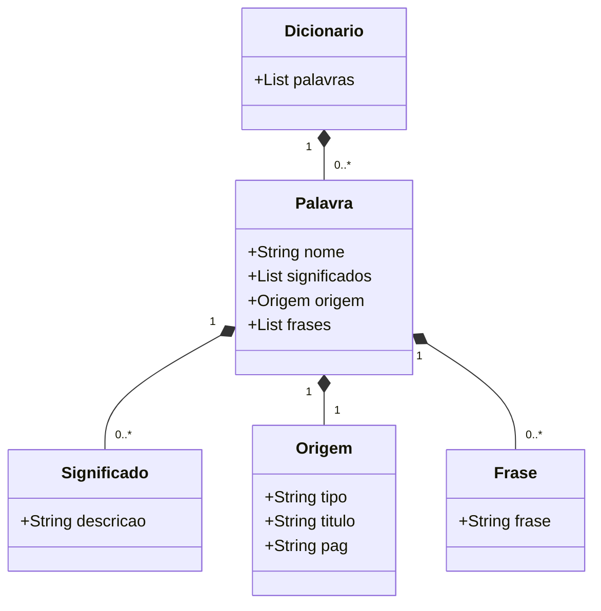

# 📖 Projeto Dicionário

Este projeto tem como objetivo a criação e manipulação de dicionários personalizados, permitindo cadastrar palavras, frases, origens e consultar as informações de forma organizada.

---

## 🌱 Origem da Ideia

Este projeto surgiu de uma necessidade pessoal: **ampliar meu vocabulário**.  
Durante pesquisas no YouTube, encontrei o vídeo [COMO AUMENTAR RÁPIDO SEU VOCABULÁRIO com 1 exercício simples (e usar no dia a dia)](https://www.youtube.com/watch?v=VtMGkOjebxw), que apresentou uma técnica prática:

- Ler um livro  
- Anotar palavras desconhecidas  
- Pesquisar seus significados  
- Criar frases utilizando essas palavras  

No entanto, fazer isso no papel se mostrou complicado:
- As palavras ficavam soltas e espalhadas em anotações diferentes  
- Muitas vezes eu esquecia onde tinha anotado  
- As frases não tinham ligação com a lista de palavras  

Diante dessa dificuldade, surgiu a ideia de criar este **sistema de dicionário digital**, que organiza todo esse processo de forma prática e acessível.

---

## 🚀 Funcionalidades Iniciais

- **Adicionar um dicionário**
- **Ver dicionários**
- **Adicionar palavra a um dicionário**
- **Adicionar frase à palavra**
- **Adicionar origem da palavra**
- **Ver dicionário completo**

---

## 📌 Futuras Melhorias
- Quebrar o menu por funcionalidades:
  - Menu de dicionários
  - Menu de palavras
  - Menu de significados
  - Menu de frases
  - Menu de origens
- Atualizar / excluir:
  - Dicionários
  - Palavras
  - Significados
  - Frases
  - Origens

---

## 🧩 Diagrama de Classes



## Banco oracle e flyway

Para conectar o Flyway ao banco Oracle, enfrentei sérios problemas, desde questões de conexão até permissões de usuários. Isso exigiu muita pesquisa, mas foi extremamente benéfico para o meu aprendizado.

Fiz um resumo explicando o motivo de ter tomado determinadas decisões para conseguir dar andamento ao projeto.


[Guia Oracle XEPDB1 Flyway](Guia_Oracle_XEPDB1_Flyway.pdf)

### Criar o usúario Dicionaro.
Para usar o flyway com Oracle  é preciso criar apartir do sys com perfil sysbda com service XEPDB1 e dar sua devidas permições.

#### **Diferença entre SID e Service Name**

**SID (XE)**
-É a instância raiz do banco Oracle.
- Representa o Container Database (CDB).
- Usuários comuns do dia a dia não existem nesse nível, apenas contas administrativas como SYS e SYSTEM.
- Se você cria um usuário normal (CREATE USER DICIONARIO...) dentro de uma PDB, ele não é visível no nível do CDB.

**Service Name (XEPDB1)**
- É o pluggable database onde você realmente cria e usa seus usuários/aplicações.
- O XEPDB1 é um serviço registrado no listener, e aponta para o PDB.
- Qualquer usuário que você criar (como DICIONARIO) só existe dentro desse PDB.
- Por isso, se você tentar logar no XE com o DICIONARIO, o Oracle responde: usuário não existe.
```
CREATE USER dicionario IDENTIFIED BY dicionario
DEFAULT TABLESPACE users
TEMPORARY TABLESPACE temp
QUOTA UNLIMITED ON users;

-- Conceder permissões básicas
GRANT CREATE SESSION TO dicionario;
GRANT CREATE TABLE TO dicionario;
GRANT CREATE SEQUENCE TO dicionario;
GRANT CREATE VIEW TO dicionario;

-- Se precisar criar procedures, funções e triggers
GRANT CREATE PROCEDURE TO dicionario;
GRANT CREATE TRIGGER TO dicionario;

-- Se precisar manipular outros objetos
GRANT CREATE SYNONYM TO dicionario;

-- Se quiser facilitar durante o desenvolvimento (não recomendado em produção)
GRANT RESOURCE TO dicionario;
```
## 🛠️ Tecnologias

- Linguagem: Java
- Banco de dados: Oracle
- Versionamento de banco: Flyway
